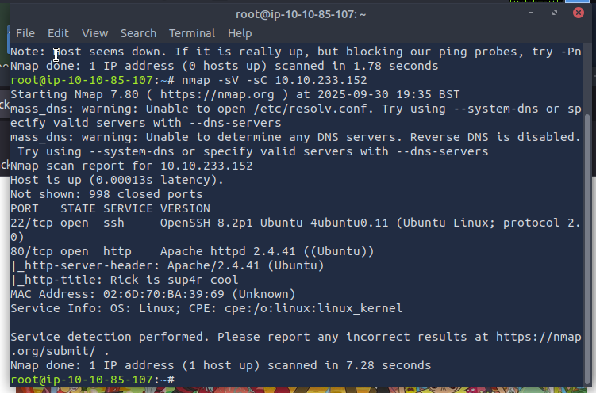
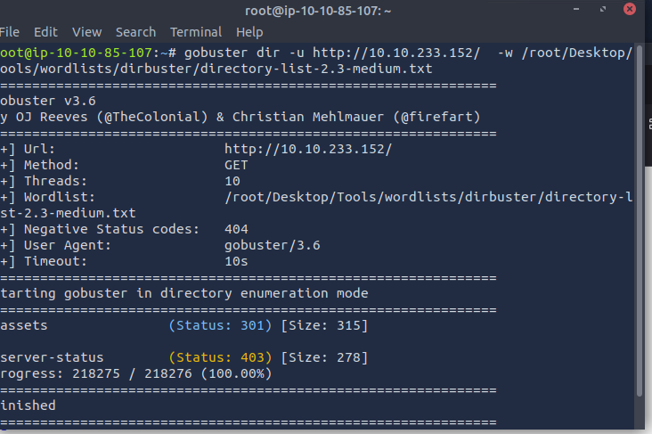
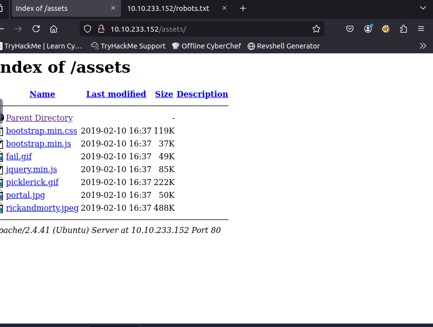
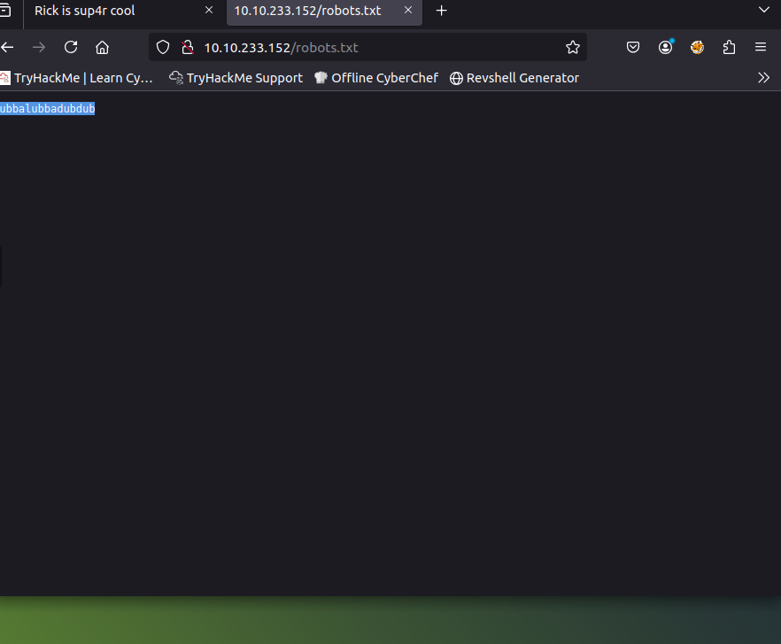
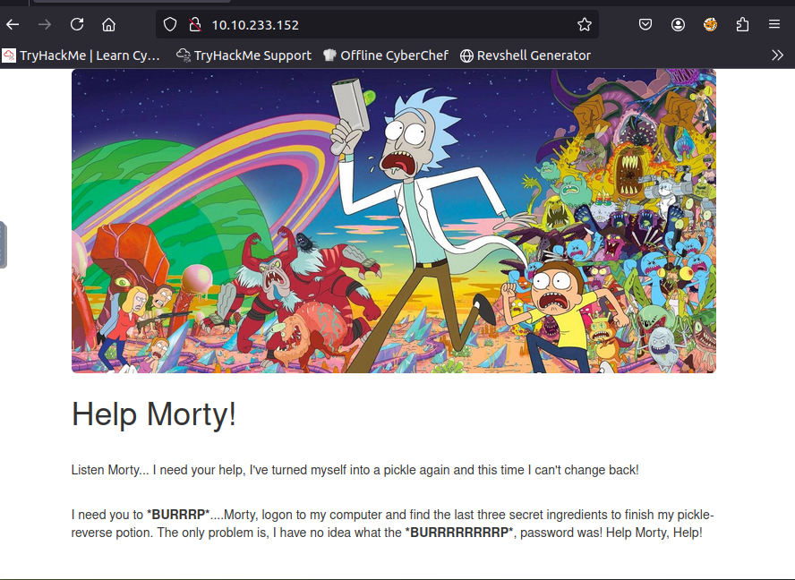
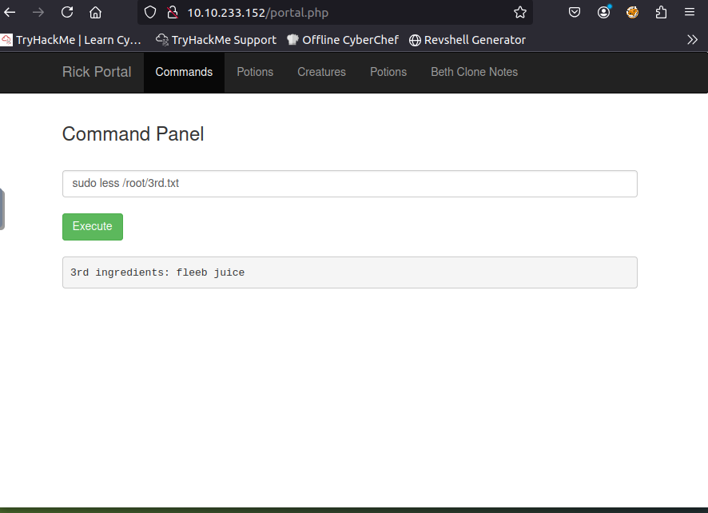

# Pickle Rick Potion — TryHackMe Writeup

**Author:** Laila  
**Target IP:** 10.10.233.152  
**Date:** 2025-09-30

This repository contains my writeup and evidence for the "Pickle Rick" TryHackMe room — a web CTF where I enumerated a web app, authenticated to a portal, and escalated to root to retrieve three secret ingredients.

---

## Quick summary
**Recovered ingredients**
1. `mr. meeseek hair`  
2. `1 jerry tear`  
3. `fleeb juice`

---

## Evidence / Screenshots

### Nmap scan

### Gobuster / assets discovered

### Assets page

### robots.txt (password found)

### How I found the login page

### Login / home page

### Portal — `ls` output (first view)

### File discovered: Sup3rS3cretPickl3Ingred.txt

### Ingredient 1 — contents of Sup3rS3cretPickl3Ingred.txt

### Check /home

### /home/rick contents

### Ingredient 2 — second ingredients file

### whoami (www-data)

### sudo -l (shows NOPASSWD: ALL)

### Root folder listing

### Ingredient 3 — /root/3rd.txt

---
